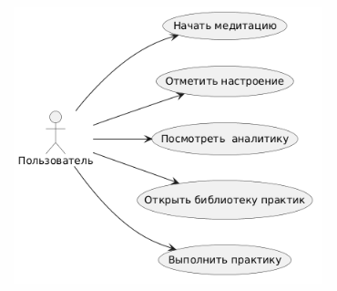

# BUC-ДИАГРАММА (Business Use Case)

## Бизнес-прецеденты MindFlow

### PlantUML-диаграмма

## Описание бизнес-прецедентов

| ID | Бизнес-прецедент | Актор | Бизнес-цель |
|----|-----------------|-------|-------------|
| BUC-01 | Начать медитацию | Пользователь | Снизить уровень стресса, улучшить фокус |
| BUC-02 | Отметить настроение | Пользователь | Понять динамику настроения и улучшить самочувствие |
| BUC-03 | Посмотреть аналитику | Пользователь | Получить наглядную обратную связь о прогрессе |
| BUC-04 | Открыть библиотеку практик	 | Пользователь | Ознакомиться с медитациями |

## Таблица контекста: бизнес-процессы → системные функции

| Бизнес-прецедент | Поддерживающие системные UC |
|------------------|-----------------------------|
| BUC-01 Начать медитацию |  Запуск сессии с таймером |
| BUC-02 Отметить настроение | Выбор эмоционального состояния |
| BUC-03 Посмотреть аналитику | График динамики настроения |
| BUC-04 Открыть библиотеку практик | Просмотр каталога  |
