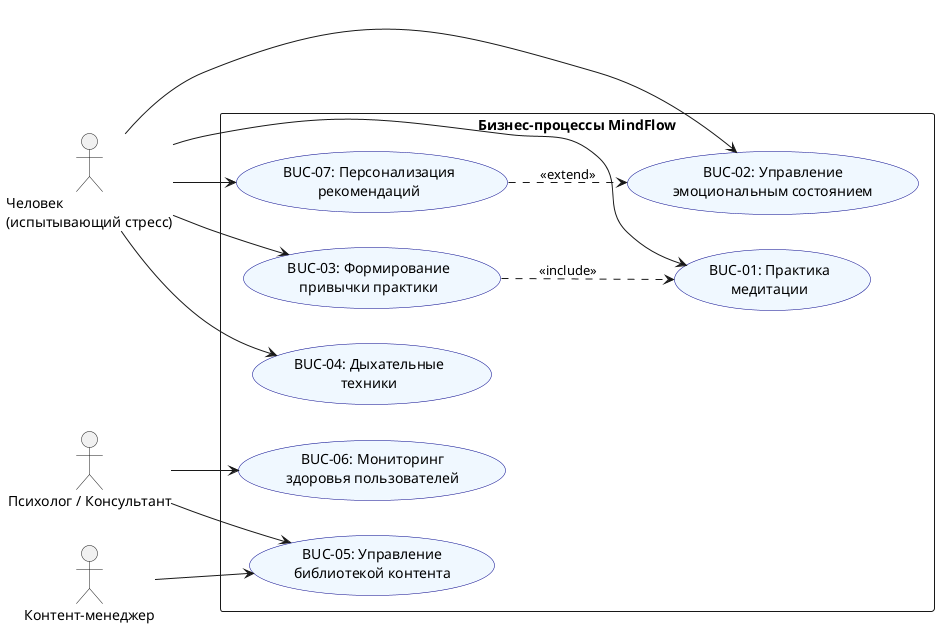

# BUC-ДИАГРАММА (Business Use Case)

## Бизнес-прецеденты MindFlow

### PlantUML-диаграмма

## Описание бизнес-прецедентов

| ID | Бизнес-прецедент | Актор | Бизнес-цель |
|----|-----------------|-------|-------------|
| BUC-01 | Практика медитации | Пользователь | Снизить уровень стресса, улучшить фокус |
| BUC-02 | Управление эмоциональным состоянием | Пользователь | Понять динамику настроения и улучшить самочувствие |
| BUC-03 | Формирование привычки практики | Пользователь | Выработать регулярную привычку медитации |
| BUC-04 | Дыхательные техники | Пользователь | Быстрое снижение тревожности через дыхание |
| BUC-05 | Управление библиотекой контента | Контент-менеджер / Эксперт | Поддерживать актуальный и качественный контент |
| BUC-06 | Мониторинг здоровья пользователей | Психолог | Отслеживать агрегированные тенденции ментального здоровья |
| BUC-07 | Персонализация рекомендаций | Пользователь | Получать подходящие медитации на основе истории настроения |

## Таблица контекста: бизнес-процессы → системные функции

| Бизнес-прецедент | Поддерживающие системные UC |
|------------------|-----------------------------|
| BUC-01 Практика медитации | UC-03 Просмотр списка, UC-04 Запуск сессии, UC-08 Офлайн |
| BUC-02 Управление состоянием | UC-05 Запись настроения, UC-06 Аналитика |
| BUC-03 Формирование привычки | UC-12 Прогресс, UC-04 Сессии |
| BUC-04 Дыхательные техники | UC-11 Дыхательное упражнение |
| BUC-05 Управление контентом | UC-09 Управление контентом (Admin) |
| BUC-06 Мониторинг | UC-10 Управление пользователями (Admin) |
| BUC-07 Персонализация | UC-06 Аналитика, UC-07 Профиль |
