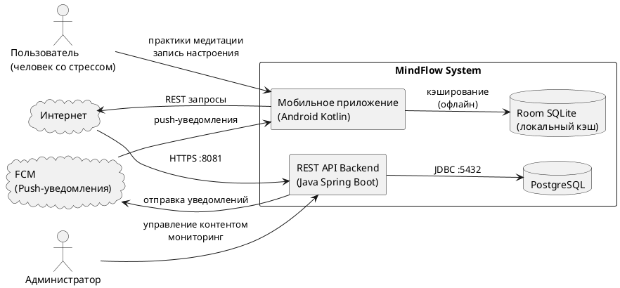

# ДИАГРАММА БИЗНЕС-КОНТЕКСТА

## Проект: MindFlow

### IDEF0 A-0 — Контекстная диаграмма

```
                  Требования пользователя
                  Запрос медитации
                  Оценка настроения (1-10)
                           │
                           ▼
  ─────────────────────────────────────────────────────
  │                                                   │
  │           MindFlow A-0                            │
  │    Поддержка ментального здоровья                 │
  │       пользователей через мобильные               │
  │       практики медитации и осознанности           │
  │                                                   │
  ─────────────────────────────────────────────────────
         │                          │
         ▼                          ▼
  Контент медитации           Аналитика настроения
  Статистика прогресса        Персонализированные
  Push-уведомления            рекомендации


Управление:
  - Методики медитации (психологический стандарт)
  - Требования GDPR (конфиденциальность данных)
  - PCMEF-архитектура

Механизмы:
  - Android-приложение (Jetpack Compose)
  - Spring Boot Backend (REST API)
  - PostgreSQL (хранилище данных)
  - Room Database (офлайн-кэш)
  - JWT (аутентификация)
```

### Контекстная диаграмма UML



### Входы и выходы системы

| Тип | Данные |
|-----|--------|
| **Вход** | Email/пароль (регистрация), оценка настроения (1-10), ID выбранной медитации |
| **Выход** | JWT-токен, контент медитации (текст/аудио), аналитика настроения, прогресс пользователя |
| **Управляющие воздействия** | Научно-обоснованные методики медитации, политика конфиденциальности |
| **Механизмы** | Android API 21+, Spring Boot 3.2, PostgreSQL 15, JWT RS256 |
