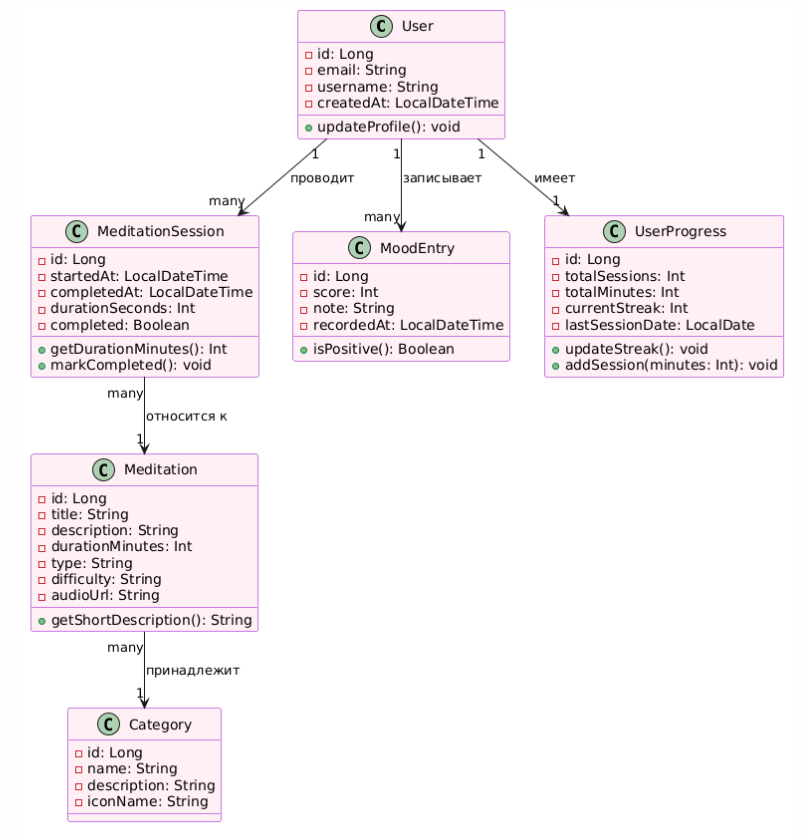

# ДОМЕННАЯ МОДЕЛЬ (Domain Model)

## PlantUML-диаграмма

## Описание сущностей

| Сущность | Ответственность | Ключевые атрибуты |
| :--- | :--- | :--- |
| User | Хранит данные пользователя, управляет аутентификацией | id, email, passwordHash, role |
| Meditation | Описывает медитативную практику | title, type, duration, content |
| MeditationSession | Фиксирует факт проведения медитации | startedAt, duration, completed |
| MoodEntry | Запись о настроении пользователя | score (1-10), note, tags |
| UserProgress | Агрегированная статистика пользователя | totalSessions, streak |
