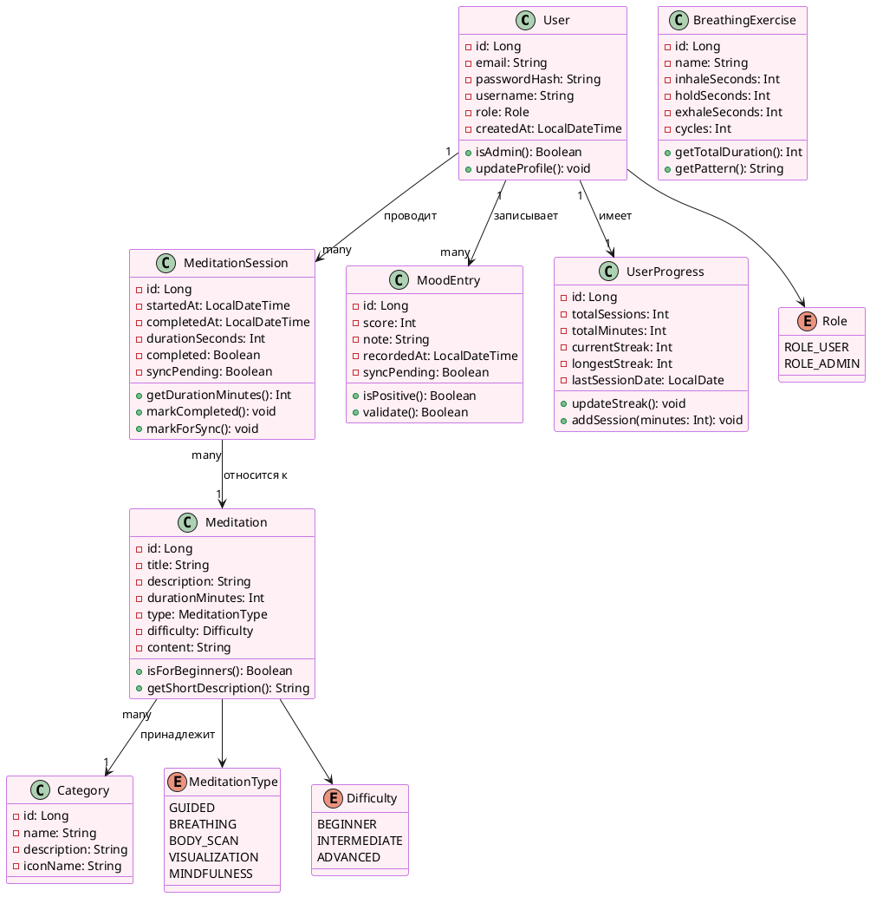

# ДОМЕННАЯ МОДЕЛЬ (Domain Model)

## PlantUML-диаграмма

## Описание сущностей

| Сущность | Ответственность | Ключевые атрибуты |
| :--- | :--- | :--- |
| User | Хранит данные пользователя, управляет аутентификацией | id, email, passwordHash, role |
| Meditation | Описывает медитативную практику | title, type, duration, content |
| MeditationSession | Фиксирует факт проведения медитации | startedAt, duration, completed |
| MoodEntry | Запись о настроении пользователя | score (1-10), note, tags |
| BreathingExercise | Параметры дыхательного упражнения | inhale, hold, exhale, cycles |
| UserProgress | Агрегированная статистика пользователя | totalSessions, streak |
| Category | Тематические категории медитаций | name, iconName |

## Бизнес-правила
1. Пользователь не может иметь более 1 записи настроения в сутки
2. Серия (streak) прерывается, если пропущен хотя бы 1 день
3. Медитация считается завершённой при прохождении >80% времени
4. Администратор может управлять медитациями, обычный пользователь — только читать