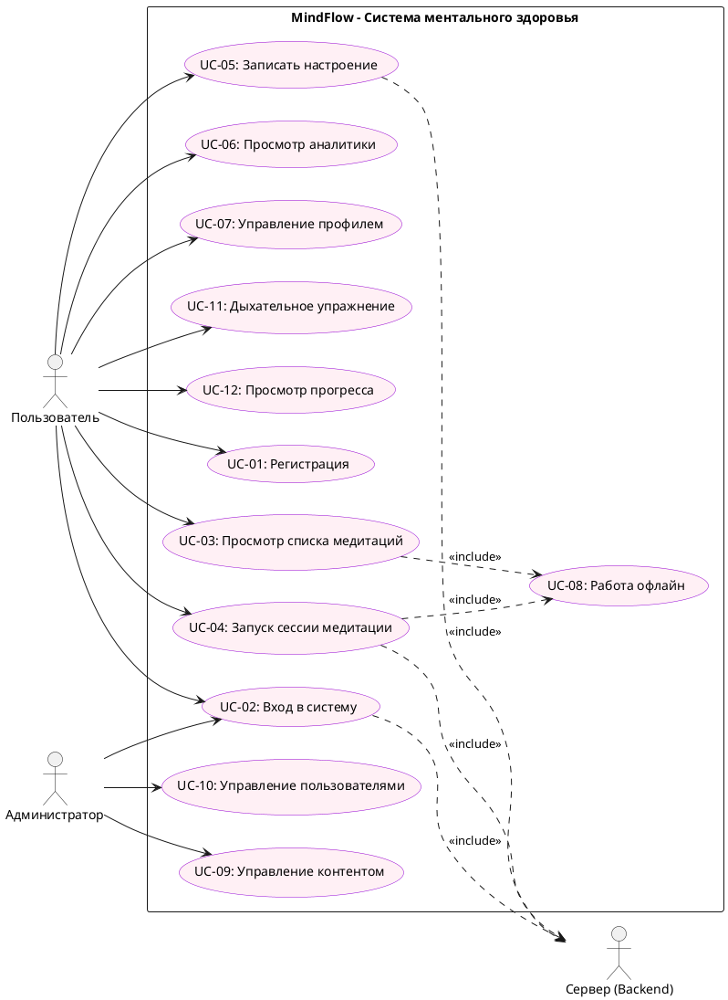

# USE CASE ДИАГРАММА

## Системные прецеденты MindFlow

### PlantUML-диаграмма

## Список прецедентов

| ID | Название | Актор | Приоритет |
| :--- | :--- | :--- | :--- |
| UC-01 | Регистрация | Пользователь | Высокий |
| UC-02 | Вход в систему (JWT) | Пользователь, Администратор | Высокий |
| UC-03 | Просмотр списка медитаций | Пользователь | Высокий |
| UC-04 | Запуск сессии медитации | Пользователь | Высокий |
| UC-05 | Запись настроения в дневник | Пользователь | Высокий |
| UC-06 | Просмотр аналитики настроения | Пользователь | Средний |
| UC-07 | Управление профилем | Пользователь | Средний |
| UC-08 | Работа в офлайн-режиме | Пользователь | Высокий |
| UC-09 | Управление контентом | Администратор | Средний |
| UC-10 | Управление пользователями | Администратор | Средний |
| UC-11 | Дыхательное упражнение | Пользователь | Средний |
| UC-12 | Просмотр прогресса | Пользователь | Средний |