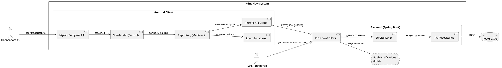
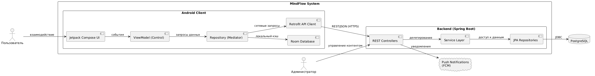
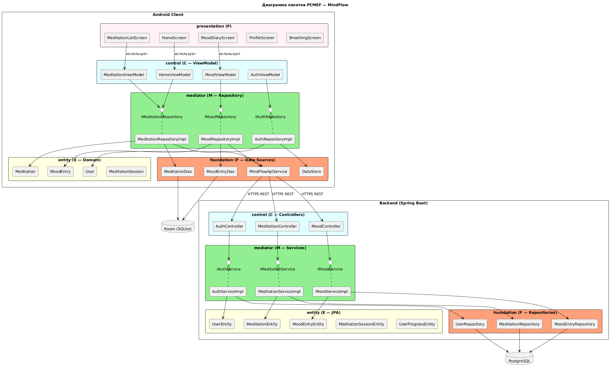
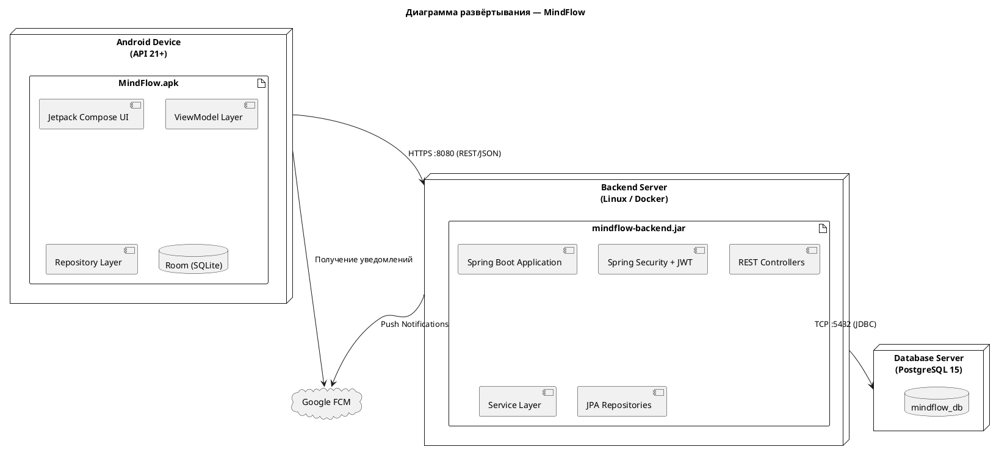
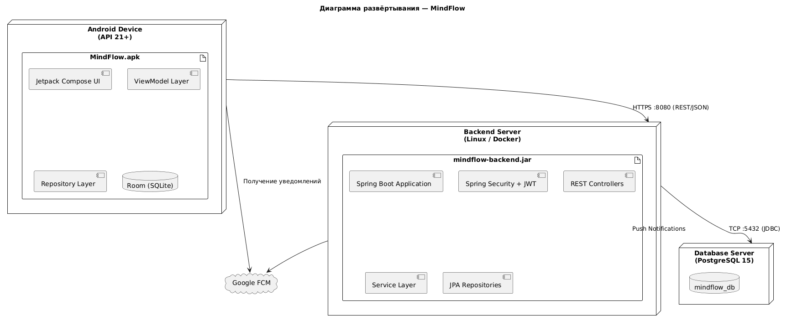

# Архитектурный документ (Arc42)

Проект: MindFlow  
Траектория: Mobile  
Версия: 1.0  
Дата: 29.05.2026  
Автор: Хатуаева Д.Т., ПИЖ-б-о-23-2

---

## 1. Введение и цели

### 1.1. Краткое описание системы

MindFlow — мобильное приложение для Android, предназначенное для
поддержки ментального здоровья пользователей. Система предоставляет
библиотеку guided-медитаций, упражнения по дыхательным практикам и
дневник настроения с визуализацией динамики эмоционального состояния.

Приложение ориентировано на людей, испытывающих стресс, тревогу или
желающих выработать регулярную практику осознанности. Пользователь
может проходить медитации офлайн, отслеживать прогресс и получать
персонализированные рекомендации на основе истории настроения.

Система состоит из двух частей: Android-клиента на Jetpack Compose
и серверной части на Java 17 + Spring Boot 3.2, взаимодействующих
через REST API. Данные хранятся в PostgreSQL на сервере и
кэшируются локально в Room (SQLite) на устройстве.

### 1.2. Цели архитектуры

|           Цель             |                            Описание                               |
|----------------------------|-------------------------------------------------------------------|
| Разделение ответственности | Чёткое разделение UI, бизнес-логики и доступа к данным по PCMEF  |
| Тестируемость              | Каждый слой тестируется изолированно через интерфейсы            |
| Масштабируемость           | Возможность добавления новых категорий медитаций без переписывания|
| Поддерживаемость           | Лёгкость внесения изменений благодаря строгим границам слоёв     |
| Офлайн-работа              | Ключевые функции доступны без интернета через Room-кэш            |

### 1.3. Стейкхолдеры

|     Стейкхолдер    |                      Интересы                              |
|--------------------|------------------------------------------------------------|
| Разработчик        | Понятная структура, независимость компонентов, тестируемость|
| Проверяющий        | Соответствие PCMEF, полнота документации                   |
| Заказчик (учебный) | Работоспособность системы, выполнение всех требований ЛР   |
| Конечный пользователь | Стабильность, быстрый отклик, работа без интернета      |

---

## 2. Ограничения

### 2.1. Технические ограничения

|     Ограничение        |         Значение                        |
|------------------------|-----------------------------------------|
| Язык серверной части   | Java 17+                                |
| Фреймворк              | Spring Boot 3.x                         |
| База данных            | PostgreSQL 15                           |
| Клиент                 | Android (Kotlin + Jetpack Compose)      |
| Минимальная версия API | Android API 21 (Android 5.0)            |
| Локальное хранилище    | Room (SQLite)                           |
| Аутентификация         | JWT (access 15 мин + refresh 7 дней)   |

### 2.2. Бизнес-ограничения

| Ограничение |      Значение           |
|-------------|-------------------------|
| Бюджет      | 0 руб. (учебный проект) |
| Сроки       | 1 семестр (18 недель)   |
| Команда     | 1 разработчик           |

---

## 3. Контекст системы

### 3.1. Бизнес-контекст

Подробное описание бизнес-контекста:  
[`00-project-charter/context-diagram.md`](../00-project-charter/context-diagram.md)

Краткая справка:  
Основная функция системы — предоставление персонализированных
медитаций и отслеживание эмоционального состояния пользователя.  
Входы: запросы пользователя, оценка настроения (1–10),
выбор медитации.  
Выходы: контент медитации, статистика прогресса,
визуализация динамики настроения.

### 3.2. Технический контекст






---

## 4. Стратегии

### 4.1. Стратегия декомпозиции

Система декомпозирована по слоям архитектурного паттерна PCMEF.

Детали выбора PCMEF и альтернативы:  
[`02-architecture/adr/adr-001-arch-pattern.md`](adr/adr-001.md)


| Слой             | Расположение Android            | Расположение Backend | Ответственность                      |
|------------------|---------------------------------|----------------------|--------------------------------------|
| Presentation (P) | Composable-функции, Activity    | —                    | UI, отображение состояния            |
| State Management | ViewModel + StateFlow           | —                    | Состояние экранов, обработка событий |
| Control (C)      | ViewModel (обработка команд)    | REST Controllers     | Валидация, маршрутизация запросов    |
| Mediator (M)     | RepositoryImpl (domain layer)   | Сервисные классы     | Бизнес-логика, координация данных    |
| Entity (E)       | Data-классы (domain)            | JPA Entity-классы    | Бизнес-объекты с методами            |
| Foundation (F)   | Room DAO + Retrofit API Service | JPA Repository       | Доступ к данным, без логики          |

### 4.2. Стратегия управления данными

- Реляционная БД PostgreSQL 15 на сервере
- Spring Data JPA для ORM на бэкенде
- Транзакции через @Transactional
- Room (SQLite) для локального кэша на Android
- Поле sync_pending = true помечает записи для синхронизации
- Стратегия offline-first: данные сначала пишутся локально, затем синхронизируются с сервером при наличии сети

### 4.3. Стратегия безопасности

Детали стратегии безопасности:  
[`02-architecture/adr/adr-003-auth-strategy.md`](adr/adr-003-auth-strategy.md)

- JWT для аутентификации (access token 15 мин, refresh 7 дней)
- BCrypt для хеширования паролей (strength = 12)
- Роли: ROLE_USER, ROLE_ADMIN
- Токены хранятся в DataStore (encrypted) на Android
- Все эндпоинты кроме /api/auth/** требуют Bearer token
- HTTPS обязателен в продакшене

---

## 5. Вид компонентов (структура)

### 5.1. Диаграмма пакетов PCMEF

@startuml
skinparam packageStyle rectangle
title Диаграмма пакетов PCMEF — MindFlow

package "Android Client" {

package "presentation (P)" #LavenderBlush {
rectangle "HomeScreen" as P1
rectangle "MeditationListScreen" as P2
rectangle "MoodDiaryScreen" as P3
rectangle "ProfileScreen" as P4
rectangle "BreathingScreen" as P5
}

package "control (C — ViewModel)" #LightCyan {
rectangle "HomeViewModel" as C1
rectangle "MeditationViewModel" as C2
rectangle "MoodViewModel" as C3
rectangle "AuthViewModel" as C4
}

package "mediator (M — Repository)" #LightGreen {
interface "IMeditationRepository" as IM1
interface "IMoodRepository" as IM2
interface "IAuthRepository" as IM3
rectangle "MeditationRepositoryImpl" as M1
rectangle "MoodRepositoryImpl" as M2
rectangle "AuthRepositoryImpl" as M3
}

package "entity (E — Domain)" #LightYellow {
rectangle "Meditation" as E1
rectangle "MoodEntry" as E2
rectangle "User" as E3
rectangle "MeditationSession" as E4
}

package "foundation (F — Data Sources)" #LightSalmon {
rectangle "MeditationDao" as F1
rectangle "MoodEntryDao" as F2
rectangle "MindFlowApiService" as F3
rectangle "DataStore" as F4
}
}

package "Backend (Spring Boot)" {

package "control (C — Controllers)" #LightCyan {
rectangle "AuthController" as BC1
rectangle "MeditationController" as BC2
rectangle "MoodController" as BC3
}

package "mediator (M — Services)" #LightGreen {
interface "IAuthService" as BM1
interface "IMeditationService" as BM2
interface "IMoodService" as BM3
rectangle "AuthServiceImpl" as BS1
rectangle "MeditationServiceImpl" as BS2
rectangle "MoodServiceImpl" as BS3
}

package "entity (E — JPA)" #LightYellow {
rectangle "UserEntity" as BE1
rectangle "MeditationEntity" as BE2
rectangle "MoodEntryEntity" as BE3
rectangle "MeditationSessionEntity" as BE4
rectangle "UserProgressEntity" as BE5
}

package "foundation (F — Repositories)" #LightSalmon {
rectangle "UserRepository" as BF1
rectangle "MeditationRepository" as BF2
rectangle "MoodEntryRepository" as BF3
}
}

database "PostgreSQL" as DB
database "Room (SQLite)" as RoomDB

P1 --> C1 : использует
P2 --> C2 : использует
P3 --> C3 : использует

C1 --> IM1
C2 --> IM1
C3 --> IM2
C4 --> IM3

IM1 <|.. M1
IM2 <|.. M2
IM3 <|.. M3

M1 --> E1
M2 --> E2
M3 --> E3

M1 --> F1
M1 --> F3
M2 --> F2
M2 --> F3
M3 --> F4

F1 --> RoomDB
F2 --> RoomDB

BC1 --> BM1
BC2 --> BM2
BC3 --> BM3

BM1 <|.. BS1
BM2 <|.. BS2
BM3 <|.. BS3

BS1 --> BE1
BS2 --> BE2
BS3 --> BE3

BS1 --> BF1
BS2 --> BF2
BS3 --> BF3

BF1 --> DB
BF2 --> DB
BF3 --> DB

F3 --> BC1 : HTTPS REST
F3 --> BC2 : HTTPS REST
F3 --> BC3 : HTTPS REST

@enduml


Рисунок 2 — Диаграмма пакетов PCMEF



### 5.2. Интерфейсы между слоями

Полные тексты интерфейсов:  
[`02-architecture/interfaces/`](interfaces/)

Control → Mediator (IService):
```java
// Mediator слой — контракт сервиса медитаций
public interface IMeditationService {
    List<MeditationDto> getAllMeditations();
    MeditationDto getMeditationById(Long id);
    List<MeditationDto> getMeditationsByCategory(Long categoryId);
    List<MeditationDto> searchMeditations(String query);
    SessionDto saveSession(Long userId, SessionRequest request);
    List<SessionDto> getUserSessions(Long userId);
}

// Mediator слой — контракт сервиса настроения
public interface IMoodService {
    MoodEntryDto saveMoodEntry(Long userId, MoodEntryRequest request);
    List<MoodEntryDto> getMoodHistory(Long userId, int days);
    MoodEntryDto getTodayEntry(Long userId);
    MoodEntryDto updateMoodEntry(Long id, Long userId, MoodEntryRequest request);
    void deleteMoodEntry(Long id, Long userId);
    Double getAverageScore(Long userId, int days);
}
```

Mediator → Foundation (IRepository):
```java
// Foundation слой — репозиторий медитаций
public interface MeditationRepository
        extends JpaRepository<MeditationEntity, Long> {
    List<MeditationEntity> findByCategoryIdAndActiveTrue(Long categoryId);
    List<MeditationEntity> findByActiveTrue();
    List<MeditationEntity> searchByQuery(String query);
}

// Foundation слой — репозиторий настроения
public interface MoodEntryRepository
        extends JpaRepository<MoodEntryEntity, Long> {
    List<MoodEntryEntity> findByUserIdOrderByRecordedAtDesc(Long userId);
    Optional<MoodEntryEntity> findTodayEntry(Long userId);
    Double getAverageScore(Long userId, LocalDateTime from, LocalDateTime to);
}
```

---

## 6. Вид выполнения (сценарии)

Подробные диаграммы последовательности:  
[`04-detailed-design/sequence-diagrams.md`](../04-detailed-design/sequence-diagrams.md)

### Сценарий 1: «Сохранение записи настроения»

```
UI → ViewModel → Repository → Room (локально) → API → Backend
```

1. Пользователь выбирает оценку настроения (1–10) и нажимает «Сохранить»
2. MoodDiaryScreen вызывает MoodViewModel.saveMood(score, note)
3. ViewModel обращается к IMoodRepository.saveMoodEntry()
4. Repository сохраняет запись в Room с sync_pending = true
5. UI обновляется немедленно (оптимистичный UI)
6. Repository пытается отправить POST /api/mood на сервер
7. При успехе — sync_pending = false, запись синхронизирована
8. При ошибке сети — запись остаётся в Room до следующей попытки

### Сценарий 2: «Запуск медитации»

```
UI → ViewModel → Repository → Room (кэш) / API → MeditationScreen
```

1. Пользователь выбирает медитацию из списка
2. MeditationViewModel.loadMeditation(id) запрашивает данные
3. Repository проверяет Room-кэш — если есть, возвращает локально
4. Если кэш устарел — запрос GET /api/meditations/{id} на сервер
5. Контент отображается на экране, запускается таймер
6. По завершении — POST /api/meditations/sessions сохраняет сессию
7. UserProgressEntity.addSession() обновляет статистику

### Сценарий 3: «Авторизация пользователя»

```
LoginScreen → AuthViewModel → AuthRepository → POST /api/auth/login
```

1. Пользователь вводит email и пароль
2. AuthViewModel.login(email, password) вызывает репозиторий
3. POST /api/auth/login отправляется на бэкенд
4. AuthController → AuthServiceImpl.login() проверяет credentials
5. При успехе возвращаются accessToken + refreshToken 
6. Токены сохраняются в DataStore (encrypted)
7. Навигация переходит на HomeScreen

---

## 7. Вид развёртывания

### 7.1. Диаграмма развёртывания



Рисунок 3 — Диаграмма развёртывания


### 7.2. Инструкция по развёртыванию

Полная инструкция:  
[`10-deployment/installation-guide.md`](../10-deployment/installation-guide.md)

Быстрый старт через Docker:
```bash
# Клонирование репозитория
git clone https://github.com/dkhatuaeva/mindflow.git
cd mindflow

# Запуск БД и бэкенда
docker-compose up -d

# Проверка работоспособности
curl http://localhost:8080/api/health
```

Запуск бэкенда вручную:
```bash
cd backend
./mvnw spring-boot:run \
  -Dspring-boot.run.arguments="
    --spring.datasource.url=jdbc:postgresql://localhost:5432/mindflow_db
    --spring.datasource.username=mindflow_user
    --spring.datasource.password=mindflow_pass"
```

Сборка Android APK:
```bash
cd android
./gradlew assembleDebug
# APK: android/app/build/outputs/apk/debug/app-debug.apk
```
---

## 8. Скрещенные концепции

### 8.1. Безопасность

- Аутентификация: JWT (HMAC-SHA256)
- Хеширование паролей: BCrypt (strength = 12)
- Авторизация: роли ROLE_USER, ROLE_ADMIN
- Хранение токенов на клиенте: Android DataStore (encrypted)
- Защита эндпоинтов: Spring Security — все маршруты кроме /api/auth/** и /swagger-ui/** требуют валидный Bearer token

### 8.2. Транзакции

- Управление через @Transactional на уровне Service
- Уровень изоляции: READ_COMMITTED (по умолчанию PostgreSQL)
- Методы только для чтения помечаются @Transactional(readOnly = true) для оптимизации производительности
---

## 9. Архитектурные решения (ADR)

📄 Все ADR находятся в папке: [`02-architecture/adr/`](adr/)

|  №      | Название                               | Статус  |
|:--------|:---------------------------------------|:--------|
| ADR-001 | Выбор архитектурного паттерна (PCMEF)  | Принято |
| ADR-002 | Выбор языка Backend (Java 17)          | Принято |
| ADR-003 | Выбор базы данных (PostgreSQL)         | Принято |
| ADR-004 | Стратегия аутентификации (JWT)         | Принято |
| ADR-005 | UI-фреймворк Android (Jetpack Compose) | Принято |
| ADR-006 | Локальное хранилище (Room)             | Принято |
| ADR-007 | HTTP-клиент Android (Retrofit)         | Принято |
| ADR-008 | Асинхронность (Coroutines + Flow)      | Принято |
| ADR-009 | Навигация (Navigation Compose)         | Принято |
---

## 10. Качество

| Атрибутт            | Целевое значение          | Способ проверки           |
|:--------------------|:--------------------------|:--------------------------|
| Тестируемость       | Покрытие кода > 40%       | JaCoCo (Maven plugin)     |
| Производительность  | Время отклика API < 200мс | JMeter / curl             |
| Офлайн-доступность  | Основные функции без сети | Ручное тестирование       |
| Корректность данных | Валидация на всех слоях   | Bean Validation + тесты   |
| Безопасность        | Нет утечки токенов        | Код-ревью, DataStore шифр |
---

## 11. Риски

| Риск                               | Вероятность | Митигация                                    |
|:-----------------------------------|:------------|:---------------------------------------------|
| N+1 проблема в JPA                 | Средняя     | Использовать `@EntityGraph`, `JOIN FETCH`    |
| Конфликты при офлайн-синхронизации | Средняя     | Стратегия «сервер имеет приоритет»           |
| Компрометация JWT refresh token    | Низкая      | Хранение в DataStore encrypted, TTL 7 дней   |
| Переполнение Room-кэша             | Низкая      | Периодическая очистка записей старше 90 дней |
| Недоступность сервера              | Средняя     | Офлайн-режим через Room, retry-логика        |
---

## 12. Глоссарий

| Термин            | Определение                                                                 |
|:------------------|:----------------------------------------------------------------------------|
| **PCMEF**         | Presentation, Control, Mediator, Entity, Foundation — архитектурный паттерн |
| **JWT**           | JSON Web Token — стандарт передачи данных аутентификации                    |
| **ADR**           | Architecture Decision Record — запись архитектурного решения                |
| **Room**          | ORM-библиотека Google поверх SQLite для Android                             |
| **Retrofit**      | HTTP-клиент для Android, декларативное описание API                         |
| **Compose**       | Декларативный UI-фреймворк для Android от Google                            |
| **StateFlow**     | Реактивный поток состояния в Kotlin Coroutines                              |
| **sync_pending**  | Флаг записи, ожидающей синхронизации с сервером                             |
| **DataStore**     | Современная замена SharedPreferences с поддержкой шифрования                |
| **WorkManager**   | Android API для фоновых задач (синхронизация)                               |
| **BCrypt**        | Алгоритм хеширования паролей с адаптивной стоимостью                        |
| **offline-first** | Стратегия: данные сначала пишутся локально, потом синхронизируются          |


