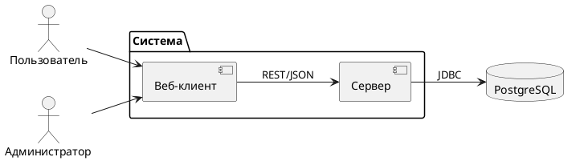
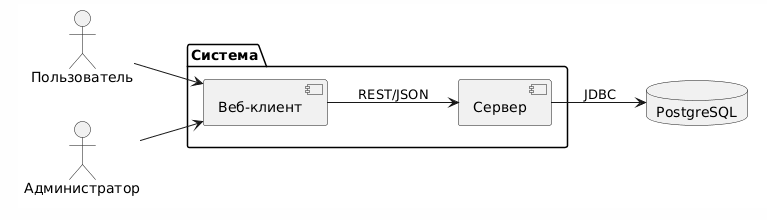

# Архитектурный документ (Arc42)

Проект: [Название проекта]  
Траектория: [Desktop / Web / Mobile / Enterprise]  
Версия: 1.0  
Дата: [ДД.ММ.ГГГГ]  
Автор: [ФИО, группа]

---

## 1. Введение и цели

### 1.1. Краткое описание системы

[2-3 абзаца о том, что делает система, для кого она предназначена]

### 1.2. Цели архитектуры

|           Цель             |                       Описание                         |
|----------------------------|--------------------------------------------------------|
| Разделение ответственности | Чёткое разделение UI, бизнес-логики и доступа к данным |
| Тестируемость              | Каждый слой должен тестироваться изолированно          |
| Масштабируемость           | Возможность добавления новых функций без переписывания |
| Поддерживаемость           | Лёгкость внесения изменений                            |

### 1.3. Стейкхолдеры

|     Стейкхолдер    |               Интересы                        |
|--------------------|-----------------------------------------------|
| Разработчики       | Понятная структура, независимость компонентов |
| Проверяющий        | Соответствие PCMEF                            |
| Заказчик (учебный) | Работоспособность системы                     |

---

## 2. Ограничения

### 2.1. Технические ограничения

|     Ограничение      |         Значение           |
|----------------------|----------------------------|
| Язык серверной части | Java 17+                   |
| Фреймворк            | Spring Boot 3.x            |
| База данных          | PostgreSQL                 |
| Клиент               | [React / Android / JavaFX] |

### 2.2. Бизнес-ограничения

| Ограничение |      Значение           |
|-------------|-------------------------|
| Бюджет      | 0 руб. (учебный проект) |
| Сроки       | 1 семестр (18 недель)   |
| Команда     | 1 разработчик           |

---

## 3. Контекст системы

### 3.1. Бизнес-контекст

Подробное описание бизнес-контекста:  
[`00-project-charter/context-diagram.md`](../00-project-charter/context-diagram.md)

Краткая справка:  
Основная функция системы — [глагол + существительное из ЛР1].  
Входы: [перечислить 2-3]. Выходы: [перечислить 2-3].

### 3.2. Технический контекст




[Рисунок 1 — Технический контекст](//www.plantuml.com/plantuml/png/FP3DIWCn483lynJ3tXVl7gJMUYdYZwju40_fRbmNsqQIqOi8TSyUn1UGla4jBXRxymoJDt8IomRoCpDVlWpfE5AM7aT36EfRGZ9eg_AEiAYipgaoOm2Lax6Oy2TlUEdV-4VsESzypKs84rGEBvssBVZEtxpY1QzvuLzzxISHtlX9HFUBKINM1vNVgr8BFWrOjArubk0pe8nh_f34Lyg_l1HLmsjVtuJhLtgm1QRSY7eUrbZ9j7sIBbu02aLge9p8JusZqkhix2Y-tUi2X5OnJVUYAJRJHZBZ-T-4ktX-c5tizBEJOzYcf2eIgVHxtGFew74XN_S7)


---

## 4. Стратегии

### 4.1. Стратегия декомпозиции

Система декомпозирована по слоям архитектурного паттерна PCMEF.

Детали выбора PCMEF и альтернативы:  
[`02-architecture/adr/adr-001-arch-pattern.md`](adr/adr-001-arch-pattern.md)

| Слой             |        Расположение        |          Ответственность       |
|------------------|----------------------------|--------------------------------|
| Presentation (P) | [React / Android / JavaFX] | UI, отображение                |
| State Management | [ViewModel / BLoC / Redux] | Состояние экранов (для Mobile) |
| Control (C)      | Spring Boot                | REST API, валидация            |
| Mediator (M)     | Spring Boot                | Бизнес-логика                  |
| Entity (E)       | Spring Boot                | JPA-сущности                   |
| Foundation (F)   | Spring Boot                | Доступ к данным                |

### 4.2. Стратегия управления данными

- Реляционная БД PostgreSQL
- Spring Data JPA для ORM
- Транзакции через `@Transactional`

### 4.3. Стратегия безопасности

Детали стратегии безопасности:  
[`02-architecture/adr/adr-003-auth-strategy.md`](adr/adr-003-auth-strategy.md)

- JWT для аутентификации
- BCrypt для хеширования паролей
- Роли: USER, ADMIN

---

## 5. Вид компонентов (структура)

### 5.1. Диаграмма пакетов PCMEF


Рисунок 2 — Диаграмма пакетов PCMEF

### 5.2. Интерфейсы между слоями

Полные тексты интерфейсов:  
[`02-architecture/interfaces/`](interfaces/)

Control → Mediator (IService):
```java
public interface IUserService {
    User getUserById(Long id);
    User createUser(User user);
    User authenticate(String email, String password);
}
```

Mediator → Foundation (IRepository):
```java
public interface IUserRepository {
    User findById(Long id);
    User save(User user);
    Optional<User> findByEmail(String email);
}
```

---

## 6. Вид выполнения (сценарии)

Подробные диаграммы последовательности:  
[`04-detailed-design/sequence-diagrams.md`](../04-detailed-design/sequence-diagrams.md)

Краткое описание ключевого сценария «Регистрация на мероприятие»:

```
UI → API Client → Controller → Service → Repository → DB
```

1. Пользователь нажимает «Зарегистрироваться»
2. API Client отправляет POST запрос
3. Controller вызывает Service
4. Service проверяет наличие мест
5. Repository сохраняет регистрацию
6. Ответ возвращается пользователю

---

## 7. Вид развёртывания

### 7.1. Диаграмма развёртывания


Рисунок 3 — Диаграмма развёртывания

### 7.2. Инструкция по развёртыванию

Полная инструкция:  
[`10-deployment/installation-guide.md`](../10-deployment/installation-guide.md)

```bash
git clone https://github.com/username/project.git
cd project/backend
./mvnw spring-boot:run
```

---

## 8. Скрещенные концепции

### 8.1. Безопасность

- Аутентификация: JWT
- Хеширование: BCrypt
- Авторизация: роли USER, ADMIN

### 8.2. Транзакции

- Управление через `@Transactional`
- Уровень изоляции: READ_COMMITTED

---

## 9. Архитектурные решения (ADR)

📄 Все ADR находятся в папке: [`02-architecture/adr/`](adr/)

|     №   |          Название             | Статус  |
|---------|-------------------------------|---------|
| ADR-001 | Выбор архитектурного паттерна | Принято |
| ADR-002 | Выбор базы данных и ORM       | Принято |
| ADR-003 | Стратегия аутентификации      | Принято |

---

## 10. Качество

| Атрибут            | Целевое значение       | Способ проверки |
|--------------------|------------------------|-----------------|
| Тестируемость      | Покрытие >40%          | JaCoCo          |
| Производительность | Время отклика < 200 мс | JMeter          |

---

## 11. Риски

| Риск                        | Митигация                   |
|-----------------------------|-----------------------------|
| N+1 проблема в JPA          | Использовать `@EntityGraph` |
| Безопасность JWT на клиенте | HttpOnly cookies            |

---

## 12. Глоссарий

| Термин | Определение                                         |
|--------|-----------------------------------------------------|
| PCMEF  | Presentation, Control, Mediator, Entity, Foundation |
| JWT    | JSON Web Token                                      |
| ADR    | Architecture Decision Record                        |
```


