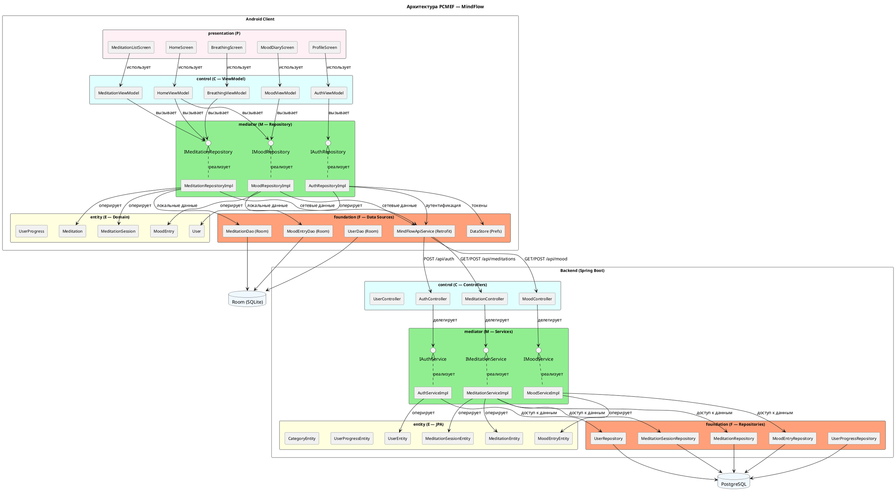

# АРХИТЕКТУРА PCMEF — MindFlow

## Адаптация PCMEF для мобильной платформы

| Слой PCMEF | Реализация на Android | Реализация на Backend |
|-----------|----------------------|----------------------|
| **P — Presentation** | Composable-функции, Activity | — |
| **C — Control** | ViewModel + StateFlow | REST Controllers |
| **M — Mediator** | Repository (domain layer) | Service классы |
| **E — Entity** | Data классы (domain) | JPA Entity классы |
| **F — Foundation** | Room DAO + Retrofit API | JPA Repository |

## PlantUML — Диаграмма пакетов



## Описание слоёв
*P — Presentation (Представление)*  
Отвечает только за отображение UI.

- Получает данные через UiState из ViewModel
- Не содержит бизнес-логики
- Не обращается напрямую к данным

```
HomeScreen
    ↓ collectAsState()
HomeViewModel.uiState: StateFlow<HomeUiState>
```

*C — Control (Управление)*  
ViewModel на Android / Controller на Backend.
- Принимает пользовательские события
- Вызывает методы Mediator-слоя
- Преобразует данные в UiState

```
fun onMeditationSelected(id: Long) {
    viewModelScope.launch {
        val meditation = meditationRepository.getById(id)  // → Mediator
        _uiState.value = UiState.Success(meditation)
    }
}
```

*M — Mediator (Посредник)*  
Repository на Android / Service на Backend.

- Координирует несколько источников данных
- Содержит бизнес-логику
- Скрывает детали реализации от Control

```
// Android
class MeditationRepositoryImpl : IMeditationRepository {
    override suspend fun getById(id: Long): Meditation {
        val local = dao.findById(id)      // Foundation (Room)
        if (local != null) return local.toDomain()
        return api.getMeditation(id)      // Foundation (Retrofit)
            .toDomain()
            .also { dao.insert(it.toEntity()) }
    }
}
```

*E — Entity (Сущность)*  
Доменные объекты — ядро бизнес-логики.

- Не зависят от фреймворков
- Содержат бизнес-методы
- Неизменяемы (data class на Android, JPA Entity на Backend)

```  
// Android domain entity
    data class MoodEntry(
    val id: Long,
    val score: Int,
    val note: String?,
    val recordedAt: LocalDateTime
) {
    fun isPositive() = score >= 7
    fun getMoodLabel() = when {
        score >= 9 -> "Отлично"
        score >= 7 -> "Хорошо"
        score >= 5 -> "Нормально"
        score >= 3 -> "Плохо"
        else       -> "Очень плохо"
    }
}  
```

*F — Foundation (Фундамент)*  
Доступ к данным — Room DAO, Retrofit API, DataStore.

- Только CRUD-операции
- Без бизнес-логики
- Скрыт за интерфейсами Mediator-слоя

``` kotlin
@Dao
interface MoodEntryDao {
    @Query("SELECT * FROM mood_entries WHERE user_id = :userId
        ORDER BY recorded_at DESC")
    fun getByUser(userId: Long): Flow<List<MoodEntryDbEntity>>
    @Insert(onConflict = OnConflictStrategy.REPLACE)
    suspend fun insert(entry: MoodEntryDbEntity)
}
```

## Правила зависимостей PCMEF

| ✅ РАЗРЕШЕНО: | ❌ ЗАПРЕЩЕНО: |
| :--- | :--- |
| P → C | P → M (минуя C) |
| C → M | P → F (минуя C, M) |
| M → E | C → F (минуя M) |
| M → F | F → M (обратная зависимость) |
| E → (ничего) | E → F (Entity не знает о БД) |
| F → (только БД/сеть) | F → C (обратная зависимость) |

## Поток данных (data flow)

Пользователь нажимает кнопку
             ↓
[P] Screen.onEvent()
             ↓
[C] ViewModel.handleEvent()
             ↓
[M] Repository.getData()
           ↙           ↘
[F] Room.query()   [F] API.request()
       ↓                   ↓
локальный кэш      сервер Backend
                           ↓
                    [C] Controller
                           ↓
                    [M] Service
                           ↓
                    [F] JpaRepository
                           ↓
                    PostgreSQL

