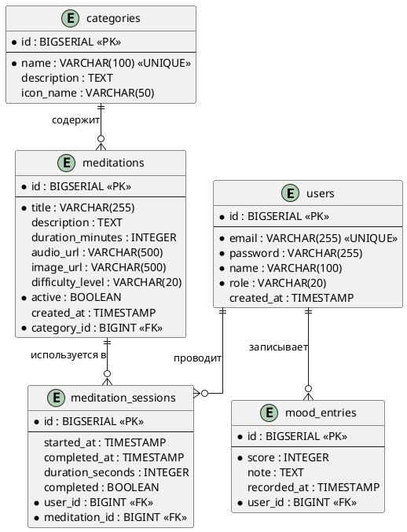

# ER-ДИАГРАММА (Entity-Relationship)

## Логическая модель данных MindFlow

### PlantUML-диаграмма

## Описание таблиц

### users
| Поле | Тип | Ограничение | Описание |
|------|-----|-------------|---------|
| id | BIGSERIAL | PK, NOT NULL | Идентификатор |
| email | VARCHAR(255) | NOT NULL, UNIQUE | Email пользователя |
| password | VARCHAR(255) | NOT NULL | BCrypt-хэш пароля |
| name | VARCHAR(100) | NOT NULL | Отображаемое имя |
| role | VARCHAR(20) | NOT NULL | ROLE_USER / ROLE_ADMIN |
| created_at | TIMESTAMP | DEFAULT NOW() | Дата регистрации |

### categories
| Поле | Тип | Ограничение | Описание |
|------|-----|-------------|---------|
| id | BIGSERIAL | PK | Идентификатор |
| name | VARCHAR(100) | NOT NULL, UNIQUE | Название категории |
| description | TEXT | — | Описание |
| icon_name | VARCHAR(50) | — | Иконка для UI |

### meditations
| Поле | Тип | Ограничение | Описание |
|------|-----|-------------|---------|
| id | BIGSERIAL | PK | Идентификатор |
| title | VARCHAR(255) | NOT NULL | Название медитации |
| description | TEXT | — | Описание |
| duration_minutes | INTEGER | CHECK > 0 | Длительность в минутах |
| audio_url | VARCHAR(500) | — | URL аудиофайла |
| image_url | VARCHAR(500) | — | URL изображения |
| difficulty_level | VARCHAR(20) | — | BEGINNER / INTERMEDIATE / ADVANCED |
| active | BOOLEAN | NOT NULL, DEFAULT TRUE | Видима ли медитация |
| created_at | TIMESTAMP | DEFAULT NOW() | Дата создания |
| category_id | BIGINT | FK → categories(id) | Категория |

### meditation_sessions
| Поле | Тип | Ограничение | Описание |
|------|-----|-------------|---------|
| id | BIGSERIAL | PK | Идентификатор |
| started_at | TIMESTAMP | DEFAULT NOW() | Начало сессии |
| completed_at | TIMESTAMP | — | Конец сессии |
| duration_seconds | INTEGER | — | Фактическая длительность |
| completed | BOOLEAN | DEFAULT FALSE | Завершена ли сессия |
| user_id | BIGINT | FK → users(id), NOT NULL | Пользователь |
| meditation_id | BIGINT | FK → meditations(id), NOT NULL | Медитация |

### mood_entries
| Поле | Тип | Ограничение | Описание |
|------|-----|-------------|---------|
| id | BIGSERIAL | PK | Идентификатор |
| score | INTEGER | NOT NULL, CHECK 1–10 | Оценка настроения |
| note | TEXT | — | Текстовая заметка |
| recorded_at | TIMESTAMP | DEFAULT NOW() | Дата записи |
| user_id | BIGINT | FK → users(id), NOT NULL | Пользователь |

## Бизнес-правила на уровне БД

1. Один пользователь — одна запись настроения в день: обеспечивается приложением (проверка через `getToday`)
2. Оценка настроения: `CHECK (score >= 1 AND score <= 10)`
3. Медитация скрывается через `active = false`, а не удаляется (soft delete)
4. Каскадное удаление: удаление пользователя → удаление его сессий и записей настроения
