# ДИАГРАММА КЛАССОВ ПРОЕКТИРОВАНИЯ

## Проект: MindFlow

### Backend - детальная диаграмма классов

```plantuml
@startuml
skinparam classBackgroundColor LightYellow
skinparam classBorderColor DarkOrange
skinparam packageStyle rectangle

package "control" #LightCyan {
  class AuthController {
    - authService: AuthService
    + register(RegisterRequest): ResponseEntity<AuthResponse>
    + login(LoginRequest): ResponseEntity<AuthResponse>
    + refresh(refreshToken: String): ResponseEntity<AuthResponse>
  }
  class MeditationController {
    - meditationService: MeditationService
    + getAll(categoryId, search): ResponseEntity<List<MeditationDto>>
    + getById(id: Long): ResponseEntity<MeditationDto>
  }
  class MoodController {
    - moodService: MoodService
    - userRepository: UserRepository
    + save(UserDetails, MoodEntryRequest): ResponseEntity<MoodEntryDto>
    + getHistory(UserDetails, days): ResponseEntity<List<MoodEntryDto>>
    + getToday(UserDetails): ResponseEntity<MoodEntryDto>
    + getAverage(UserDetails, days): ResponseEntity<Double>
    + delete(UserDetails, id): ResponseEntity<Void>
  }
}

package "mediator" #LightGreen {
  interface AuthService {
    + register(RegisterRequest): AuthResponse
    + login(LoginRequest): AuthResponse
    + refresh(refreshToken: String): AuthResponse
  }
  class AuthServiceImpl {
    - userRepository: UserRepository
    - jwtUtil: JwtUtil
    - passwordEncoder: PasswordEncoder
    + register(request): AuthResponse
    + login(request): AuthResponse
    + refresh(token): AuthResponse
  }

  interface MeditationService {
    + getAll(): List<MeditationDto>
    + getById(id: Long): MeditationDto
    + getByCategory(categoryId: Long): List<MeditationDto>
    + search(query: String): List<MeditationDto>
  }
  class MeditationServiceImpl {
    - meditationRepository: MeditationRepository
    + getAll(): List<MeditationDto>
    + getById(id): MeditationDto
    + getByCategory(categoryId): List<MeditationDto>
    + search(query): List<MeditationDto>
    - toDto(m: Meditation): MeditationDto
  }

  interface MoodService {
    + save(userId: Long, request: MoodEntryRequest): MoodEntryDto
    + getHistory(userId: Long, days: Int): List<MoodEntryDto>
    + getToday(userId: Long): MoodEntryDto
    + getAverage(userId: Long, days: Int): Double
    + delete(id: Long, userId: Long): void
  }
  class MoodServiceImpl {
    - moodEntryRepository: MoodEntryRepository
    - userRepository: UserRepository
    + save(userId, request): MoodEntryDto
    + getHistory(userId, days): List<MoodEntryDto>
    + getToday(userId): MoodEntryDto
    + getAverage(userId, days): Double
    + delete(id, userId): void
  }
}

package "entity" #LightYellow {
  class User {
    - id: Long
    - email: String
    - password: String
    - name: String
    - role: Role
    - createdAt: LocalDateTime
    - moodEntries: List<MoodEntry>
    - sessions: List<MeditationSession>
    + onCreate(): void
    enum Role { ROLE_USER, ROLE_ADMIN }
  }
  class Meditation {
    - id: Long
    - title: String
    - description: String
    - durationMinutes: Integer
    - audioUrl: String
    - imageUrl: String
    - difficultyLevel: String
    - active: Boolean
    - createdAt: LocalDateTime
    - category: Category
    - sessions: List<MeditationSession>
    + onCreate(): void
  }
  class MoodEntry {
    - id: Long
    - score: Integer
    - note: String
    - recordedAt: LocalDateTime
    - user: User
    + getMoodLabel(): String
    + onCreate(): void
  }
  class MeditationSession {
    - id: Long
    - startedAt: LocalDateTime
    - completedAt: LocalDateTime
    - durationSeconds: Integer
    - completed: Boolean
    - user: User
    - meditation: Meditation
  }
  class Category {
    - id: Long
    - name: String
    - description: String
    - iconName: String
    - meditations: List<Meditation>
  }
}

package "foundation" #LightSalmon {
  interface UserRepository {
    + findByEmail(email: String): Optional<User>
  }
  interface MeditationRepository {
    + findByActiveTrue(): List<Meditation>
    + findByCategoryIdAndActiveTrue(categoryId): List<Meditation>
    + searchByQuery(query): List<Meditation>
  }
  interface MoodEntryRepository {
    + findByUserIdOrderByRecordedAtDesc(userId): List<MoodEntry>
    + findTodayByUserId(userId): Optional<MoodEntry>
    + getAverageScore(userId, from, to): Double
  }
  interface MeditationSessionRepository
  interface CategoryRepository
}

package "dto" {
  class AuthResponse {
    + accessToken: String
    + refreshToken: String
    + email: String
    + name: String
    + role: String
  }
  class MeditationDto {
    + id: Long
    + title: String
    + description: String
    + durationMinutes: Integer
    + audioUrl: String
    + imageUrl: String
    + difficultyLevel: String
    + categoryName: String
  }
  class MoodEntryDto {
    + id: Long
    + score: Integer
    + note: String
    + recordedAt: LocalDateTime
    + moodLabel: String
  }
}

' Зависимости Control → Mediator
AuthController --> AuthService
MeditationController --> MeditationService
MoodController --> MoodService

' Реализации Mediator
AuthService <|.. AuthServiceImpl
MeditationService <|.. MeditationServiceImpl
MoodService <|.. MoodServiceImpl

' Mediator → Foundation
AuthServiceImpl --> UserRepository
MeditationServiceImpl --> MeditationRepository
MoodServiceImpl --> MoodEntryRepository
MoodServiceImpl --> UserRepository

' Entity связи
User "1" --o "many" MoodEntry
User "1" --o "many" MeditationSession
Meditation "1" --o "many" MeditationSession
Category "1" --o "many" Meditation

' JpaRepository наследование
UserRepository --|> JpaRepository
MeditationRepository --|> JpaRepository
MoodEntryRepository --|> JpaRepository
MeditationSessionRepository --|> JpaRepository
CategoryRepository --|> JpaRepository

interface JpaRepository<T, ID> {
  + findById(id: ID): Optional<T>
  + save(entity: T): T
  + findAll(): List<T>
  + deleteById(id: ID): void
}

@enduml
```

## Описание ключевых проектных решений

| Класс | Паттерн | Обоснование |
|-------|---------|-------------|
| `AuthServiceImpl` | Strategy (BCrypt) | Абстрагирует алгоритм хеширования паролей |
| `MeditationRepositoryImpl` | Repository | Изолирует доступ к данным от бизнес-логики |
| `MoodEntry.getMoodLabel()` | Business Method | Entity содержит поведение, не является анемичной |
| `JwtUtil` | Utility | Инкапсулирует всю JWT-логику в одном месте |
| `JwtAuthFilter` | Chain of Responsibility | Фильтр Spring Security проверяет токен перед каждым запросом |
