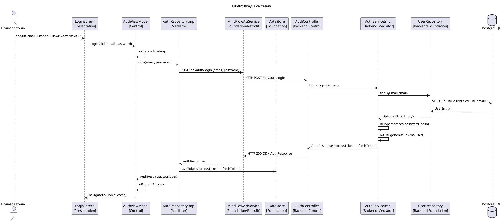
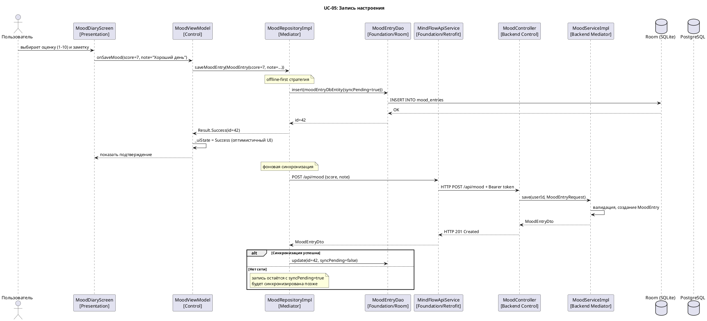
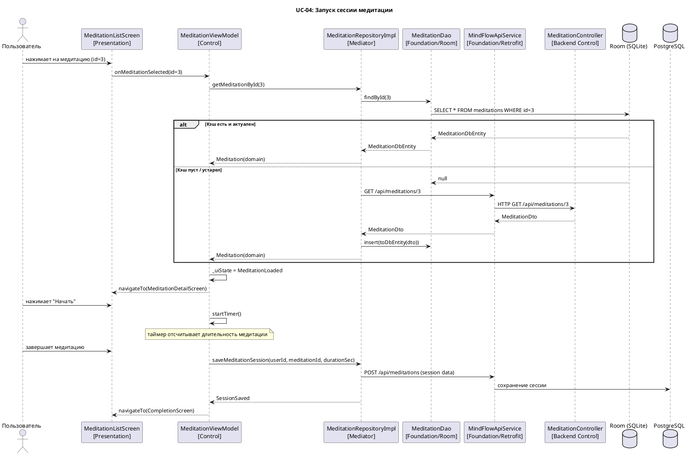

# ДИАГРАММЫ ПОСЛЕДОВАТЕЛЬНОСТИ

## Проект: MindFlow

---

## Сценарий 1: Аутентификация пользователя (UC-02)

---

## Сценарий 2: Запись настроения (UC-05)

---

## Сценарий 3: Запуск медитации (UC-04)

