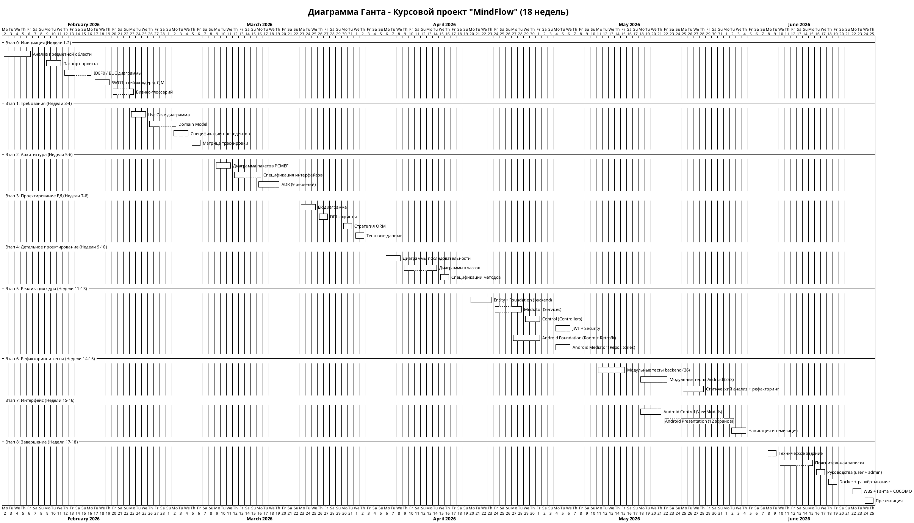

# Диаграмма Ганта — MindFlow

## Календарный план разработки (18 недель)

## Сводная таблица этапов

| Этап | Период | Недели | Ключевые результаты | % веса |
|------|--------|--------|---------------------|--------|
| 0: Инициация | 02.02–13.02 | 1–2 | Паспорт, IDEF0, BUC, глоссарий | 5% |
| 1: Требования | 16.02–27.02 | 3–4 | Use Case, Domain Model, трассировка | 10% |
| 2: Архитектура | 02.03–13.03 | 5–6 | PCMEF, интерфейсы, ADR | 10% |
| 3: БД | 16.03–27.03 | 7–8 | ER, DDL, ORM-стратегия | 10% |
| 4: Детальное проектирование | 30.03–10.04 | 9–10 | Sequence, Class diagrams | 10% |
| 5: Реализация ядра | 13.04–01.05 | 11–13 | Backend + Android core | 15% |
| 6: Рефакторинг и тесты | 04.05–15.05 | 14–15 | Тесты, покрытие >40%, паттерны | 10% |
| 7: Интерфейс | 11.05–22.05 | 15–16 | 12 экранов, Material Design 3 | 15% |
| 8: Завершение | 25.05–19.06 | 17–18 | Документация, Docker, презентация | 15% |
| **ИТОГО** | 02.02–19.06 | **18 нед.** | | **100%** |

