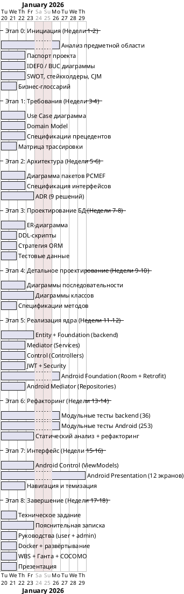

# Диаграмма Ганта — MindFlow

## Календарный план разработки (18 недель)

## Сводная таблица этапов

| Этап | Период | Недели | Ключевые результаты | % веса |
|------|--------|--------|---------------------|--------|
| 0: Инициация | 20.01–02.02 | 1–2 | Паспорт, IDEF0, BUC, глоссарий | 5% |
| 1: Требования | 03.02–16.02 | 3–4 | Use Case, Domain Model, трассировка | 10% |
| 2: Архитектура | 17.02–02.03 | 5–6 | PCMEF, интерфейсы, ADR | 10% |
| 3: БД | 03.03–16.03 | 7–8 | ER, DDL, ORM-стратегия | 10% |
| 4: Детал. проектирование | 17.03–30.03 | 9–10 | Sequence, Class diagrams | 10% |
| 5: Реализация ядра | 31.03–13.04 | 11–12 | Backend + Android core | 15% |
| 6: Рефакторинг | 14.04–27.04 | 13–14 | Тесты, покрытие >40%, паттерны | 10% |
| 7: Интерфейс | 28.04–11.05 | 15–16 | 12 экранов, Material Design 3 | 15% |
| 8: Завершение | 12.05–25.05 | 17–18 | Документация, Docker, презентация | 15% |
| **ИТОГО** | 20.01–25.05 | **18 нед.** | | **100%** |

## Контрольные точки (Milestones)

| Дата | Milestone |
|------|-----------|
| 02.02.2026 | ✅ Утверждён паспорт проекта |
| 16.02.2026 | ✅ Зафиксированы требования |
| 02.03.2026 | ✅ Архитектура утверждена |
| 16.03.2026 | ✅ Схема БД готова |
| 13.04.2026 | ✅ Ядро системы реализовано |
| 27.04.2026 | ✅ Покрытие тестами >40% |
| 11.05.2026 | ✅ Мобильный интерфейс готов |
| 25.05.2026 | 🎯 Проект сдан |
